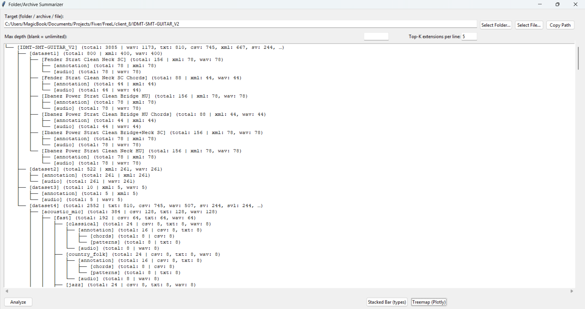
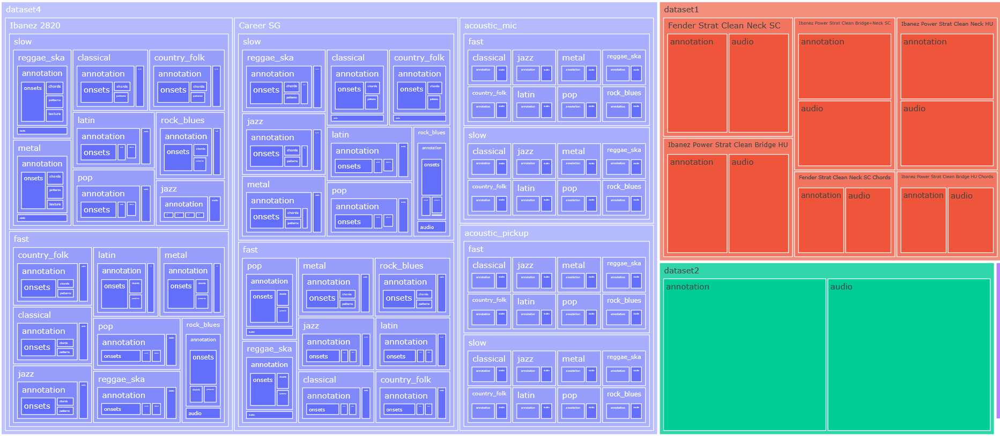

# FileStructView

**FileStructView** is a Python-based tool for analyzing and visualizing the structure of folders and archives.
It provides a hierarchical tree view and an interactive treemap to help you quickly understand the distribution of files by type and location.

---

## 📌 Features

- **Folder / Archive Analysis** – Inspect directory structures or archive contents.
- **Extension Statistics** – View counts of file types at each level.
- **Max Depth Limiting** – Focus on only part of the hierarchy.
- **Top-K Extensions** – Display only the most common extensions in each group.
- **Visualizations**:

  - **Tree View** – A clean text-based summary of files and folders.
  - **Treemap (Plotly)** – An interactive, zoomable map of file distribution.
  - **Stacked Bar Chart** – Compare file type proportions visually.

---

## 📂 Example Outputs

### **Tree View**



### **Treemap View**



---

## ⚙️ Installation

1. **Clone the repository**

   ```bash
   git clone https://github.com/shahabaalam/FileStructView.git
   cd FileStructView
   ```

2. **Create and activate a virtual environment**

   ```bash
   python -m venv venv
   # Windows
   venv\Scripts\activate
   # macOS/Linux
   source venv/bin/activate
   ```

3. **Install dependencies**

   ```bash
   pip install -r requirements.txt
   ```

---

## ▶️ Usage

Run the main script:

```bash
python StructView.py
```

1. Select a folder or file to analyze.
2. Adjust **Max Depth** and **Top-K Extensions** as needed.
3. Click **Analyze** to generate:

   - Tree View
   - Treemap
   - Stacked Bar Chart

---

## 🗂 .gitignore

The `.gitignore` includes:

```
venv/
__pycache__/
*.pyc
*.pyo
*.pyd
*.DS_Store
.env
```

---

## 💡 Project Idea

**FileStructView** helps developers, researchers, and data analysts quickly understand the contents of large datasets or codebases without manually browsing folders.
